# Diagramas del sistema — v10.0

Diagramas de arquitectura, datos, flujos, estados y secuencias del sistema de consorcios.
Están escritos en [Mermaid](https://mermaid.js.org/): GitHub los dibuja solos al abrir este archivo. En VS Code
se ven con la extensión *Markdown Preview Mermaid Support*, y en <https://mermaid.live> pegando el bloque.

Si se cambia una regla de negocio, hay que actualizar el diagrama que corresponda en este archivo.

## Índice

1. [Arquitectura](#1-arquitectura)
2. [Módulos y funciones principales (diagrama de clases)](#2-módulos-y-funciones-principales-diagrama-de-clases)
3. [Modelo de datos (entidad-relación)](#3-modelo-de-datos-entidad-relación)
4. [Casos de uso](#4-casos-de-uso)
5. [Mapa de pantallas](#5-mapa-de-pantallas)
6. [Flujo mensual de trabajo](#6-flujo-mensual-de-trabajo)
7. [Diagramas de estado](#7-diagramas-de-estado)
8. [Cálculos](#8-cálculos)
9. [Diagramas de secuencia](#9-diagramas-de-secuencia)

---

## 1. Arquitectura

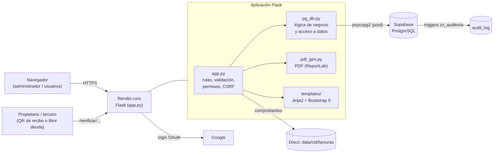
```mermaid
flowchart LR
    U["Navegador<br/>(administrador / usuarios)"] -->|HTTPS| R["Render.com<br/>Flask (app.py)"]
    P["Propietario / tercero<br/>(QR de recibo o libre deuda)"] -->|"/verificar/..."| R
    R -->|"login OAuth"| G["Google"]
    subgraph APP["Aplicación Flask"]
        A["app.py<br/>rutas, validación,<br/>permisos, CSRF"]
        D["pg_db.py<br/>lógica de negocio<br/>y acceso a datos"]
        F["pdf_gen.py<br/>PDF (ReportLab)"]
        T["templates/<br/>Jinja2 + Bootstrap 5"]
        A --> D
        A --> F
        A --> T
    end
    R --- APP
    D -->|"psycopg2 (pool)"| S[("Supabase<br/>PostgreSQL")]
    S -->|"triggers zz_auditoria"| L[("audit_log")]
    A -->|"comprobantes"| FS[("Disco: data/cid/facturas")]
```

**Capas:** `app.py` solo enruta y valida; toda regla de negocio está en `pg_db.py`; `pdf_gen.py` solo dibuja.
Cada consorcio es un `consorcio_id` dentro de las mismas tablas (multi-consorcio).

---

## 2. Módulos y funciones principales (diagrama de clases)

La aplicación no está escrita con clases: son módulos de funciones. El diagrama muestra cada módulo
como una "clase", con sus grupos de funciones, y quién usa a quién.

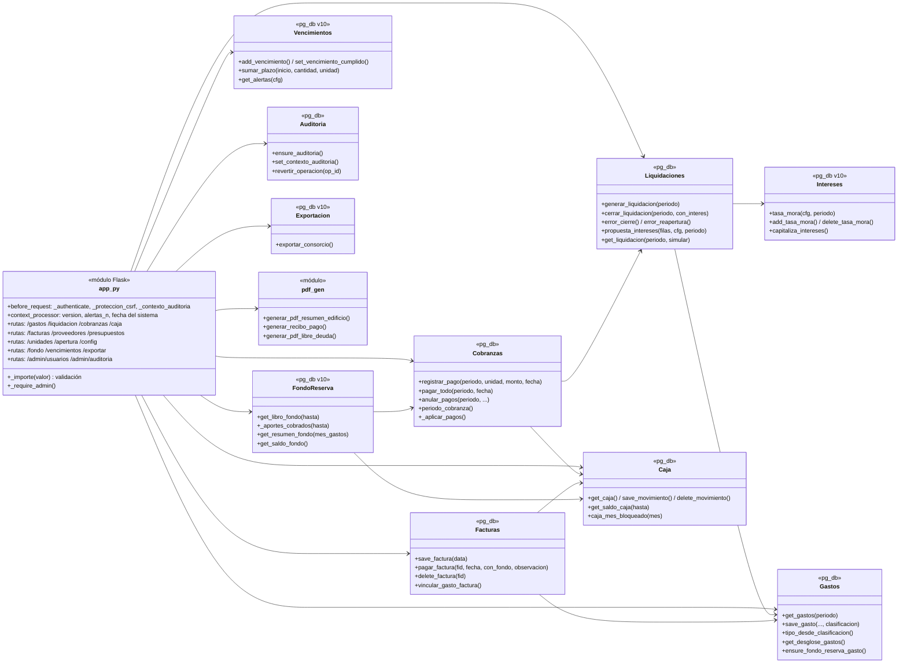
```mermaid
classDiagram
    direction LR
    class app_py {
        <<módulo Flask>>
        +before_request: _authenticate, _proteccion_csrf, _contexto_auditoria
        +context_processor: version, alertas_n, fecha del sistema
        +_importe(valor) validación
        +_require_admin()
        +rutas: /gastos /liquidacion /cobranzas /caja
        +rutas: /facturas /proveedores /presupuestos
        +rutas: /unidades /apertura /config
        +rutas: /fondo /vencimientos /exportar
        +rutas: /admin/usuarios /admin/auditoria
    }
    class Liquidaciones {
        <<pg_db>>
        +generar_liquidacion(periodo)
        +cerrar_liquidacion(periodo, con_interes)
        +error_cierre() / error_reapertura()
        +propuesta_intereses(filas, cfg, periodo)
        +get_liquidacion(periodo, simular)
    }
    class Intereses {
        <<pg_db v10>>
        +tasa_mora(cfg, periodo)
        +add_tasa_mora() / delete_tasa_mora()
        +capitaliza_intereses()
    }
    class Cobranzas {
        <<pg_db>>
        +registrar_pago(periodo, unidad, monto, fecha)
        +pagar_todo(periodo, fecha)
        +anular_pagos(periodo, ...)
        +periodo_cobranza()
        +_aplicar_pagos()
    }
    class Gastos {
        <<pg_db>>
        +get_gastos(periodo)
        +save_gasto(..., clasificacion)
        +tipo_desde_clasificacion()
        +get_desglose_gastos()
        +ensure_fondo_reserva_gasto()
    }
    class Facturas {
        <<pg_db>>
        +save_factura(data)
        +pagar_factura(fid, fecha, con_fondo, observacion)
        +delete_factura(fid)
        +vincular_gasto_factura()
    }
    class Caja {
        <<pg_db>>
        +get_caja() / save_movimiento() / delete_movimiento()
        +get_saldo_caja(hasta)
        +caja_mes_bloqueado(mes)
    }
    class FondoReserva {
        <<pg_db v10>>
        +get_libro_fondo(hasta)
        +_aportes_cobrados(hasta)
        +get_resumen_fondo(mes_gastos)
        +get_saldo_fondo()
    }
    class Vencimientos {
        <<pg_db v10>>
        +add_vencimiento() / set_vencimiento_cumplido()
        +sumar_plazo(inicio, cantidad, unidad)
        +get_alertas(cfg)
    }
    class Auditoria {
        <<pg_db>>
        +ensure_auditoria()
        +set_contexto_auditoria()
        +revertir_operacion(op_id)
    }
    class Exportacion {
        <<pg_db v10>>
        +exportar_consorcio()
    }
    class pdf_gen {
        <<módulo>>
        +generar_pdf_resumen_edificio()
        +generar_recibo_pago()
        +generar_pdf_libre_deuda()
    }
    app_py --> Liquidaciones
    app_py --> Cobranzas
    app_py --> Gastos
    app_py --> Facturas
    app_py --> Caja
    app_py --> FondoReserva
    app_py --> Vencimientos
    app_py --> Auditoria
    app_py --> Exportacion
    app_py --> pdf_gen
    Liquidaciones --> Intereses
    Liquidaciones --> Gastos
    Cobranzas --> Caja
    Cobranzas --> Liquidaciones
    Facturas --> Caja
    Facturas --> Gastos
    FondoReserva --> Caja
    FondoReserva --> Cobranzas
```

---

## 3. Modelo de datos (entidad-relación)

Todas las tablas de negocio tienen `consorcio_id` (FK a `consorcios`, borrado en cascada).
Las líneas punteadas son vínculos lógicos que maneja el código (no son claves foráneas en la base). Para que se lea, no se dibuja la relación de cada tabla con `consorcios`; `vencimientos`, `audit_log`, `config` y las demás cuelgan de él de la misma forma.

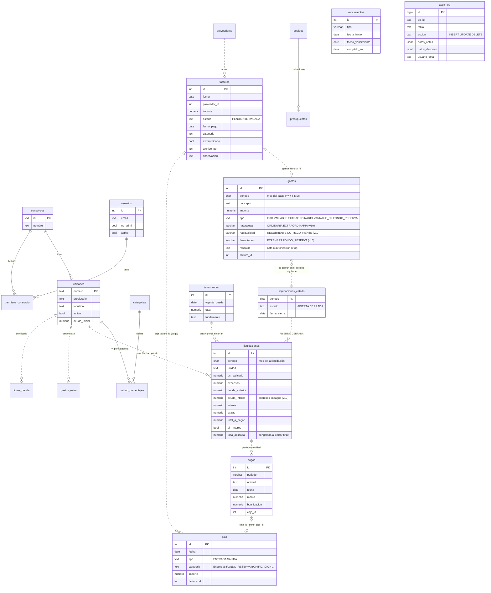
```mermaid
erDiagram
    consorcios ||--o{ unidades : tiene
    usuarios ||--o{ permisos_consorcio : tiene
    consorcios ||--o{ permisos_consorcio : habilita
    unidades ||--o{ unidad_porcentajes : "% por categoría"
    categorias ||--o{ unidad_porcentajes : define
    unidades ||..o{ liquidaciones : "una fila por período"
    liquidaciones_estado ||..o{ liquidaciones : "ABIERTA / CERRADA"
    liquidaciones ||..o{ pagos : "periodo + unidad"
    pagos |o..o| caja : "caja_id / bonif_caja_id"
    unidades ||..o{ gastos_extra : "cargo extra"
    unidades ||..o{ libres_deuda : certificado
    proveedores ||..o{ facturas : emite
    facturas |o..o| gastos : "gastos.factura_id"
    facturas |o..o{ caja : "caja.factura_id (pago)"
    pedidos ||--o{ presupuestos : cotizaciones
    gastos }o..|| liquidaciones_estado : "se cobran en el período siguiente"
    tasas_mora ||..o{ liquidaciones : "tasa vigente al cerrar"

    consorcios {
        text id PK
        text nombre
    }
    unidades {
        text numero PK
        text propietario
        text inquilino
        bool activo
        numeric deuda_inicial
    }
    gastos {
        int id PK
        char periodo "mes del gasto (YYYY-MM)"
        text concepto
        numeric importe
        text tipo "FIJO VARIABLE EXTRAORDINARIO VARIABLE_FR FONDO_RESERVA"
        varchar naturaleza "ORDINARIA EXTRAORDINARIA (v10)"
        varchar habitualidad "RECURRENTE NO_RECURRENTE (v10)"
        varchar financiacion "EXPENSAS FONDO_RESERVA (v10)"
        text respaldo "acta o autorización (v10)"
        int factura_id
    }
    liquidaciones {
        int id PK
        char periodo "mes de la liquidación"
        text unidad
        numeric pct_aplicado
        numeric expensas
        numeric deuda_anterior
        numeric deuda_interes "intereses impagos (v10)"
        numeric interes
        numeric extras
        numeric total_a_pagar
        bool sin_interes
        numeric tasa_aplicada "congelada al cerrar (v10)"
    }
    liquidaciones_estado {
        char periodo PK
        text estado "ABIERTA CERRADA"
        date fecha_cierre
    }
    pagos {
        int id PK
        varchar periodo
        text unidad
        date fecha
        numeric monto
        numeric bonificacion
        int caja_id
    }
    caja {
        int id PK
        date fecha
        text tipo "ENTRADA SALIDA"
        text categoria "Expensas FONDO_RESERVA BONIFICACION ..."
        numeric importe
        int factura_id
    }
    facturas {
        int id PK
        date fecha
        int proveedor_id
        numeric importe
        text estado "PENDIENTE PAGADA"
        date fecha_pago
        text categoria
        bool extraordinario
        text archivo_pdf
        text observacion
    }
    tasas_mora {
        int id PK
        date vigente_desde
        numeric tasa
        text fundamento
    }
    vencimientos {
        int id PK
        varchar tipo
        date fecha_inicio
        date fecha_vencimiento
        date cumplido_en
    }
    audit_log {
        bigint id PK
        text op_id
        text tabla
        text accion "INSERT UPDATE DELETE"
        jsonb datos_antes
        jsonb datos_despues
        text usuario_email
    }
    usuarios {
        int id PK
        text email
        bool es_admin
        bool activo
    }
```

Otras tablas: `gastos_recurrentes`, `gastos_extra`, `notas_periodo`, `libres_deuda`, `tareas`, `checkpoints`,
`pedidos` / `presupuestos`. La configuración del consorcio (datos del edificio, administración, apertura,
saldo inicial del fondo, fecha del sistema, etc.) está en `config` como pares clave/valor.

---

## 4. Casos de uso

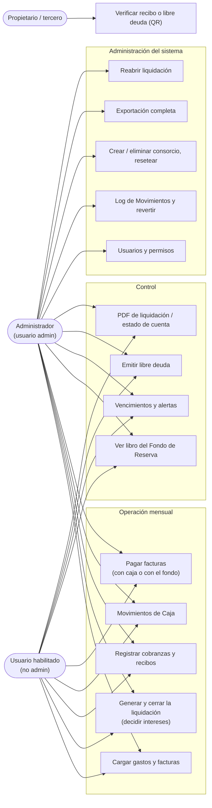
```mermaid
flowchart LR
    ADM(["Administrador<br/>(usuario admin)"])
    USR(["Usuario habilitado<br/>(no admin)"])
    EXT(["Propietario / tercero"])

    subgraph Operación mensual
        UC1["Cargar gastos y facturas"]
        UC2["Generar y cerrar la liquidación<br/>(decidir intereses)"]
        UC3["Registrar cobranzas y recibos"]
        UC4["Movimientos de Caja"]
        UC5["Pagar facturas<br/>(con caja o con el fondo)"]
    end
    subgraph Control
        UC6["Ver libro del Fondo de Reserva"]
        UC7["Vencimientos y alertas"]
        UC8["Emitir libre deuda"]
        UC9["PDF de liquidación / estado de cuenta"]
    end
    subgraph Administración del sistema
        UC10["Usuarios y permisos"]
        UC11["Log de Movimientos y revertir"]
        UC12["Crear / eliminar consorcio, resetear"]
        UC13["Exportación completa"]
        UC14["Reabrir liquidación"]
    end
    UC15["Verificar recibo o libre deuda (QR)"]

    USR --> UC1 & UC2 & UC3 & UC4 & UC5 & UC6 & UC7 & UC8 & UC9
    ADM --> UC1 & UC2 & UC3 & UC4 & UC5 & UC6 & UC7 & UC8 & UC9
    ADM --> UC10 & UC11 & UC12 & UC13 & UC14
    EXT --> UC15
```

---

## 5. Mapa de pantallas

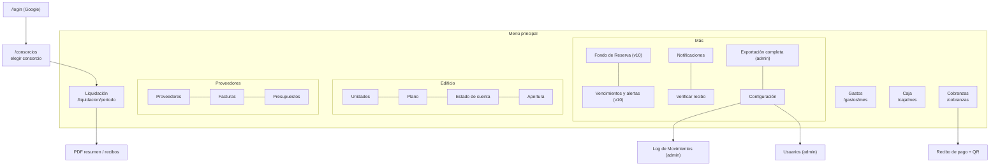
```mermaid
flowchart TB
    LOGIN["/login (Google)"] --> SEL["/consorcios<br/>elegir consorcio"]
    SEL --> LIQ
    subgraph MENU["Menú principal"]
        GAS["Gastos<br/>/gastos/mes"]
        LIQ["Liquidación<br/>/liquidacion/periodo"]
        COB["Cobranzas<br/>/cobranzas"]
        CAJ["Caja<br/>/caja/mes"]
        subgraph EDI["Edificio"]
            UNI["Unidades"] --- PLA["Plano"] --- EST["Estado de cuenta"] --- APE["Apertura"]
        end
        subgraph PRO["Proveedores"]
            PRV["Proveedores"] --- FAC["Facturas"] --- PRE["Presupuestos"]
        end
        subgraph MAS["Más"]
            FON["Fondo de Reserva (v10)"] --- VEN["Vencimientos y alertas (v10)"]
            NOT["Notificaciones"] --- VER["Verificar recibo"]
            EXP["Exportación completa (admin)"] --- CFG["Configuración"]
        end
    end
    CFG --> AUD["Log de Movimientos (admin)"]
    CFG --> USU["Usuarios (admin)"]
    LIQ --> PDF["PDF resumen / recibos"]
    COB --> REC["Recibo de pago + QR"]
```

**Ayuda en pantalla:** con **Shift + mouse** sobre el menú y algunos botones aparece una explicación
(`data-ayuda`). El manual completo es [`manual_usuario.md`](manual_usuario.md).

---

## 6. Flujo mensual de trabajo

Liquidación **a mes vencido**: los gastos del mes P-1 se cobran en la liquidación P.

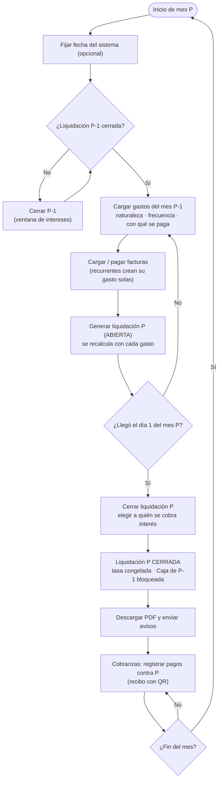
```mermaid
flowchart TD
    A(["Inicio de mes P"]) --> B["Fijar fecha del sistema (opcional)"]
    B --> C{"¿Liquidación P-1 cerrada?"}
    C -- No --> C1["Cerrar P-1<br/>(ventana de intereses)"] --> C
    C -- Sí --> D["Cargar gastos del mes P-1<br/>naturaleza · frecuencia · con qué se paga"]
    D --> E["Cargar / pagar facturas<br/>(recurrentes crean su gasto solas)"]
    E --> F["Generar liquidación P (ABIERTA)<br/>se recalcula con cada gasto"]
    F --> G{"¿Llegó el día 1 del mes P?"}
    G -- No --> D
    G -- Sí --> H["Cerrar liquidación P<br/>elegir a quién se cobra interés"]
    H --> I["Liquidación P CERRADA<br/>tasa congelada · Caja de P-1 bloqueada"]
    I --> J["Descargar PDF y enviar avisos"]
    J --> K["Cobranzas: registrar pagos contra P<br/>(recibo con QR)"]
    K --> L{"¿Fin del mes?"}
    L -- No --> K
    L -- Sí --> A
```

---

## 7. Diagramas de estado

### 7.1 Liquidación de un período

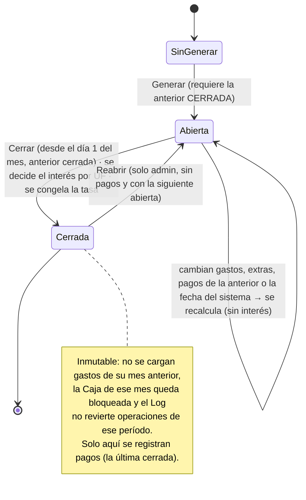
```mermaid
stateDiagram-v2
    [*] --> SinGenerar
    SinGenerar --> Abierta: Generar (requiere la anterior CERRADA)
    Abierta --> Abierta: cambian gastos, extras, pagos de la anterior o la fecha del sistema → se recalcula (sin interés)
    Abierta --> Cerrada: Cerrar (desde el día 1 del mes, anterior cerrada) · se decide el interés por UF · se congela la tasa
    Cerrada --> Abierta: Reabrir (solo admin, sin pagos y con la siguiente abierta)
    Cerrada --> [*]
    note right of Cerrada
        Inmutable: no se cargan gastos de su mes anterior,
        la Caja de ese mes queda bloqueada y el Log
        no revierte operaciones de ese período.
        Solo aquí se registran pagos (la última cerrada).
    end note
```

### 7.2 Situación de pago de una UF en una liquidación cerrada

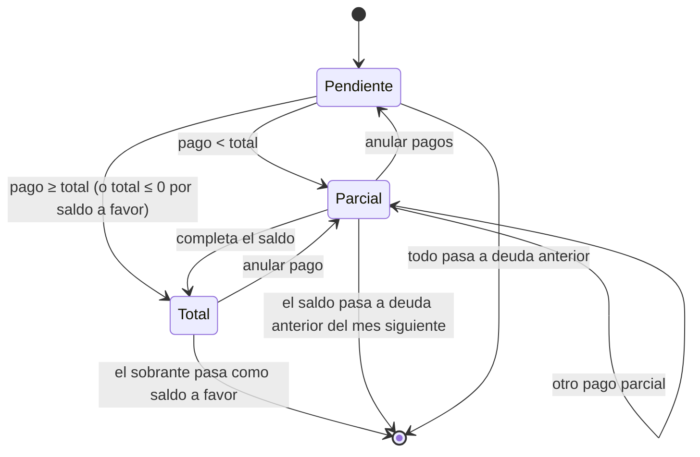
```mermaid
stateDiagram-v2
    [*] --> Pendiente
    Pendiente --> Parcial: pago < total
    Pendiente --> Total: pago ≥ total (o total ≤ 0 por saldo a favor)
    Parcial --> Total: completa el saldo
    Parcial --> Parcial: otro pago parcial
    Total --> Parcial: anular pago
    Parcial --> Pendiente: anular pagos
    Total --> [*]: el sobrante pasa como saldo a favor
    Parcial --> [*]: el saldo pasa a deuda anterior del mes siguiente
    Pendiente --> [*]: todo pasa a deuda anterior
```

### 7.3 Factura de proveedor

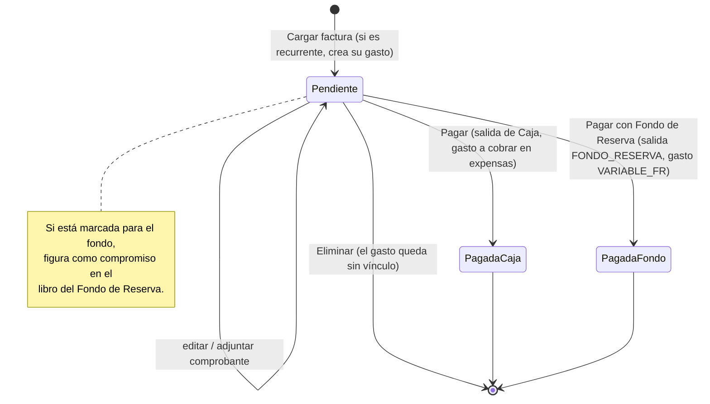
```mermaid
stateDiagram-v2
    [*] --> Pendiente: Cargar factura (si es recurrente, crea su gasto)
    Pendiente --> Pendiente: editar / adjuntar comprobante
    Pendiente --> PagadaCaja: Pagar (salida de Caja, gasto a cobrar en expensas)
    Pendiente --> PagadaFondo: Pagar con Fondo de Reserva (salida FONDO_RESERVA, gasto VARIABLE_FR)
    Pendiente --> [*]: Eliminar (el gasto queda sin vínculo)
    PagadaCaja --> [*]
    PagadaFondo --> [*]
    note right of Pendiente
        Si está marcada para el fondo,
        figura como compromiso en el
        libro del Fondo de Reserva.
    end note
```

### 7.4 Gasto: de la clasificación al tipo de cálculo (v10.0)

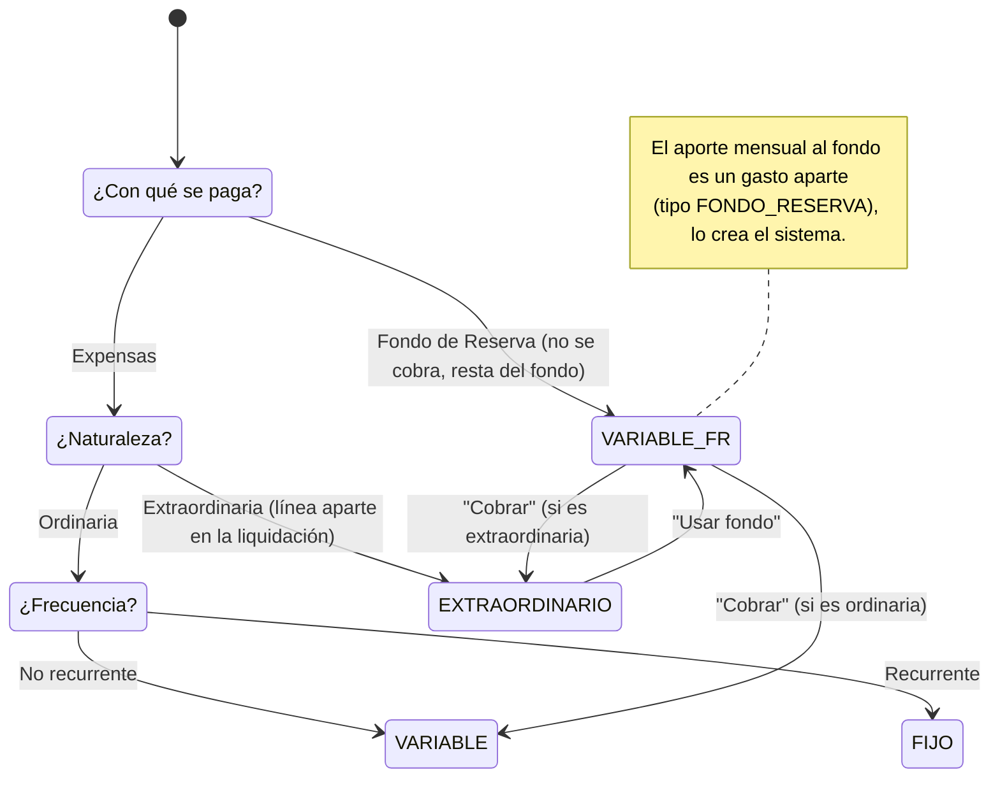
```mermaid
stateDiagram-v2
    state "¿Con qué se paga?" as fin
    state "¿Naturaleza?" as nat
    state "¿Frecuencia?" as hab
    [*] --> fin
    fin --> VARIABLE_FR: Fondo de Reserva (no se cobra, resta del fondo)
    fin --> nat: Expensas
    nat --> EXTRAORDINARIO: Extraordinaria (línea aparte en la liquidación)
    nat --> hab: Ordinaria
    hab --> FIJO: Recurrente
    hab --> VARIABLE: No recurrente
    VARIABLE_FR --> VARIABLE: "Cobrar" (si es ordinaria)
    VARIABLE_FR --> EXTRAORDINARIO: "Cobrar" (si es extraordinaria)
    EXTRAORDINARIO --> VARIABLE_FR: "Usar fondo"
    note left of VARIABLE_FR
        El aporte mensual al fondo es un gasto aparte
        (tipo FONDO_RESERVA), lo crea el sistema.
    end note
```

### 7.5 Caja de un mes

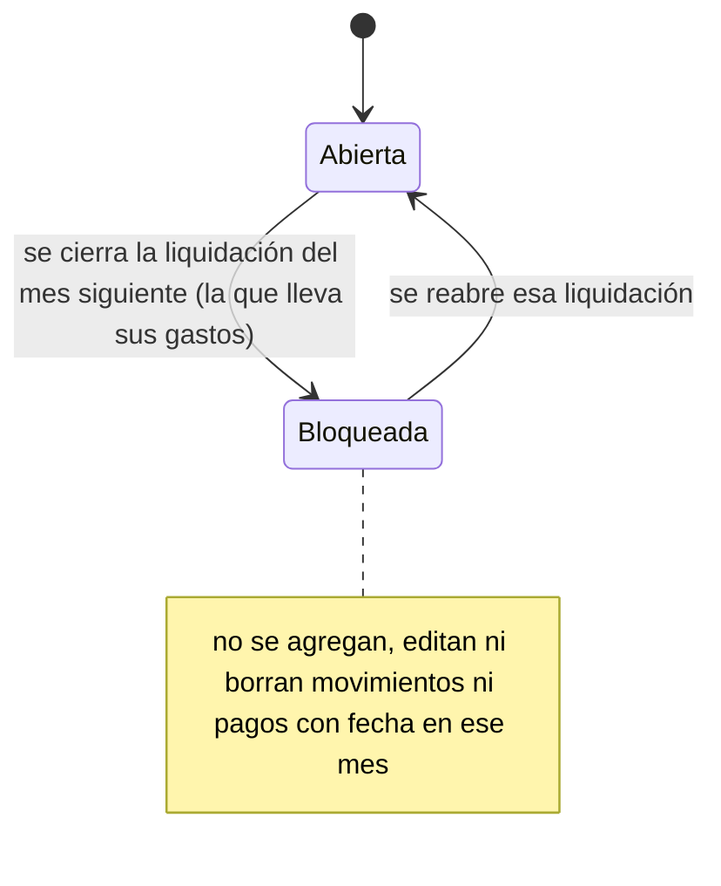
```mermaid
stateDiagram-v2
    [*] --> Abierta
    Abierta --> Bloqueada: se cierra la liquidación del mes siguiente (la que lleva sus gastos)
    Bloqueada --> Abierta: se reabre esa liquidación
    note right of Bloqueada: no se agregan, editan ni borran movimientos ni pagos con fecha en ese mes
```

### 7.6 Usuario

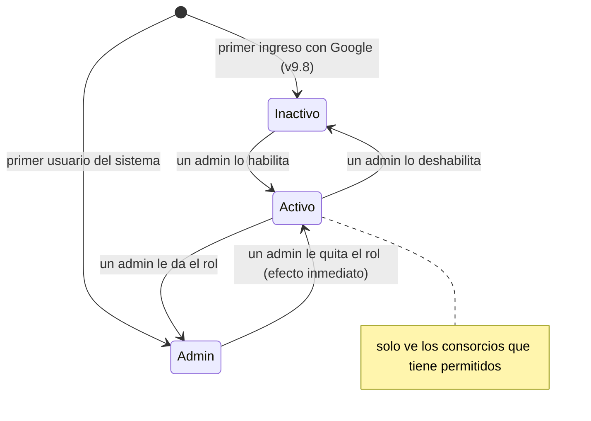
```mermaid
stateDiagram-v2
    [*] --> Inactivo: primer ingreso con Google (v9.8)
    [*] --> Admin: primer usuario del sistema
    Inactivo --> Activo: un admin lo habilita
    Activo --> Inactivo: un admin lo deshabilita
    Activo --> Admin: un admin le da el rol
    Admin --> Activo: un admin le quita el rol (efecto inmediato)
    note right of Activo: solo ve los consorcios que tiene permitidos
```

### 7.7 Vencimiento / alerta (v10.0)

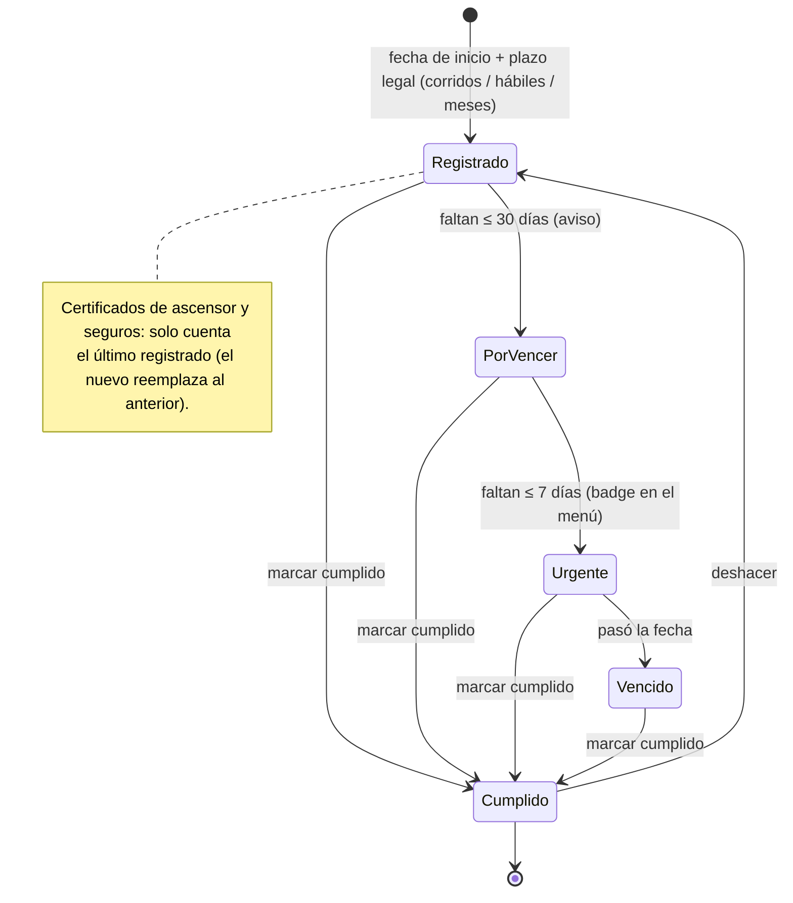
```mermaid
stateDiagram-v2
    [*] --> Registrado: fecha de inicio + plazo legal (corridos / hábiles / meses)
    Registrado --> PorVencer: faltan ≤ 30 días (aviso)
    PorVencer --> Urgente: faltan ≤ 7 días (badge en el menú)
    Urgente --> Vencido: pasó la fecha
    Registrado --> Cumplido: marcar cumplido
    PorVencer --> Cumplido: marcar cumplido
    Urgente --> Cumplido: marcar cumplido
    Vencido --> Cumplido: marcar cumplido
    Cumplido --> Registrado: deshacer
    Cumplido --> [*]
    note right of Registrado
        Certificados de ascensor y seguros: solo cuenta
        el último registrado (el nuevo reemplaza al anterior).
    end note
```

### 7.8 Certificado de libre deuda

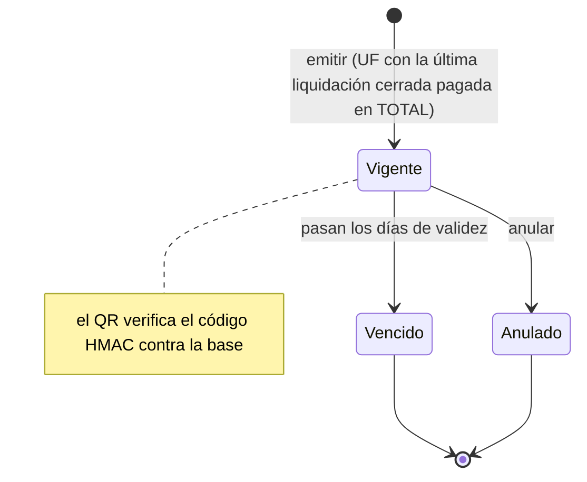
```mermaid
stateDiagram-v2
    [*] --> Vigente: emitir (UF con la última liquidación cerrada pagada en TOTAL)
    Vigente --> Vencido: pasan los días de validez
    Vigente --> Anulado: anular
    Vencido --> [*]
    Anulado --> [*]
    note right of Vigente: el QR verifica el código HMAC contra la base
```

### 7.9 Operación del Log de Movimientos

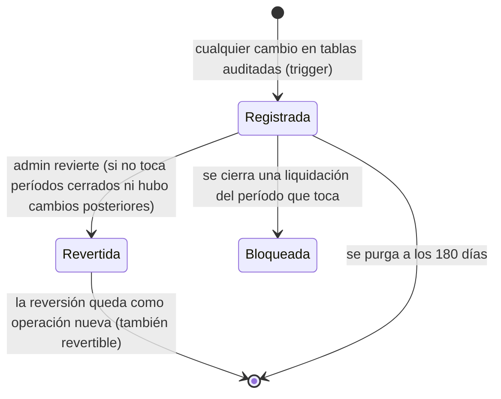
```mermaid
stateDiagram-v2
    [*] --> Registrada: cualquier cambio en tablas auditadas (trigger)
    Registrada --> Revertida: admin revierte (si no toca períodos cerrados ni hubo cambios posteriores)
    Registrada --> Bloqueada: se cierra una liquidación del período que toca
    Revertida --> [*]: la reversión queda como operación nueva (también revertible)
    Registrada --> [*]: se purga a los 180 días
```

---

## 8. Cálculos

### 8.1 Generar la liquidación del período P

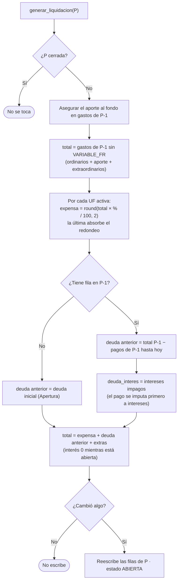
```mermaid
flowchart TD
    A["generar_liquidacion(P)"] --> B{"¿P cerrada?"}
    B -- Sí --> Z(["No se toca"])
    B -- No --> C["Asegurar el aporte al fondo en gastos de P-1"]
    C --> D["total = gastos de P-1 sin VARIABLE_FR<br/>(ordinarios + aporte + extraordinarios)"]
    D --> E["Por cada UF activa:<br/>expensa = round(total × % / 100, 2)<br/>la última absorbe el redondeo"]
    E --> F{"¿Tiene fila en P-1?"}
    F -- No --> G["deuda anterior = deuda inicial (Apertura)"]
    F -- Sí --> H["deuda anterior = total P-1 − pagos de P-1 hasta hoy"]
    H --> I["deuda_interes = intereses impagos<br/>(el pago se imputa primero a intereses)"]
    G --> J
    I --> J["total = expensa + deuda anterior + extras<br/>(interés 0 mientras está abierta)"]
    J --> K{"¿Cambió algo?"}
    K -- No --> Z2(["No escribe"])
    K -- Sí --> L["Reescribe las filas de P · estado ABIERTA"]
```

### 8.2 Interés al cerrar (v10.0, CCyC 770 y 903)

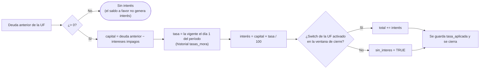
```mermaid
flowchart LR
    A["Deuda anterior de la UF"] --> B{"¿> 0?"}
    B -- No --> N(["Sin interés<br/>(el saldo a favor no genera interés)"])
    B -- Sí --> C["capital = deuda anterior − intereses impagos"]
    C --> D["tasa = la vigente el día 1 del período<br/>(historial tasas_mora)"]
    D --> E["interés = capital × tasa / 100"]
    E --> F{"¿Switch de la UF activado<br/>en la ventana de cierre?"}
    F -- Sí --> G["total += interés"]
    F -- No --> H["sin_interes = TRUE"]
    G & H --> I["Se guarda tasa_aplicada y se cierra"]
```

**Ejemplo** ($100.000 por mes, 3 %, sin pagar): noviembre 203.000 → diciembre 309.000 (interés 6.000 sobre
200.000 de capital) → enero 418.000. Con capitalización serían 418.362,70.

### 8.3 Libro del Fondo de Reserva (v10.0, lineamientos §4)

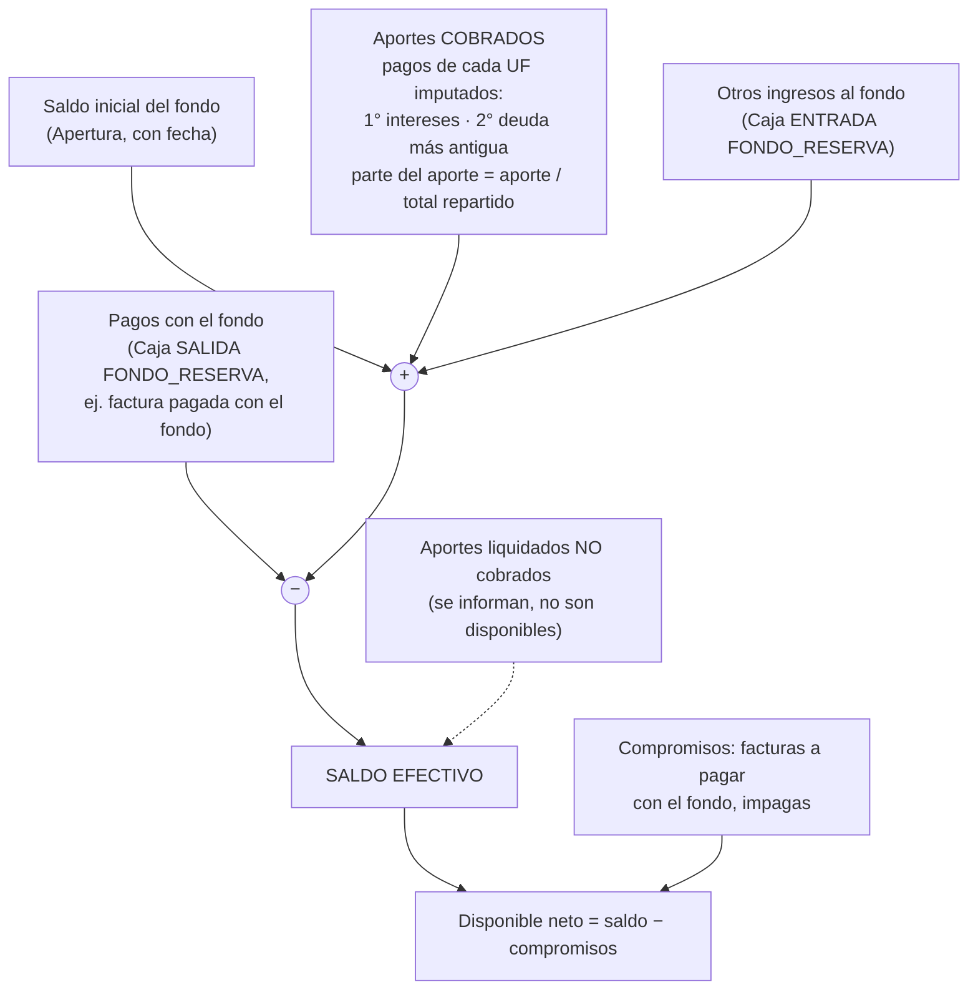
```mermaid
flowchart TD
    SI["Saldo inicial del fondo<br/>(Apertura, con fecha)"] --> SUM(("+"))
    AC["Aportes COBRADOS<br/>pagos de cada UF imputados:<br/>1° intereses · 2° deuda más antigua<br/>parte del aporte = aporte / total repartido"] --> SUM
    OI["Otros ingresos al fondo<br/>(Caja ENTRADA FONDO_RESERVA)"] --> SUM
    PG["Pagos con el fondo<br/>(Caja SALIDA FONDO_RESERVA,<br/>ej. factura pagada con el fondo)"] --> RES(("−"))
    SUM --> RES --> SE["SALDO EFECTIVO"]
    SE --> DN["Disponible neto = saldo − compromisos"]
    CP["Compromisos: facturas a pagar<br/>con el fondo, impagas"] --> DN
    PC["Aportes liquidados NO cobrados<br/>(se informan, no son disponibles)"] -.-> SE
```

---

## 9. Diagramas de secuencia

### 9.1 Pedido HTTP (qué pasa antes de cada pantalla)

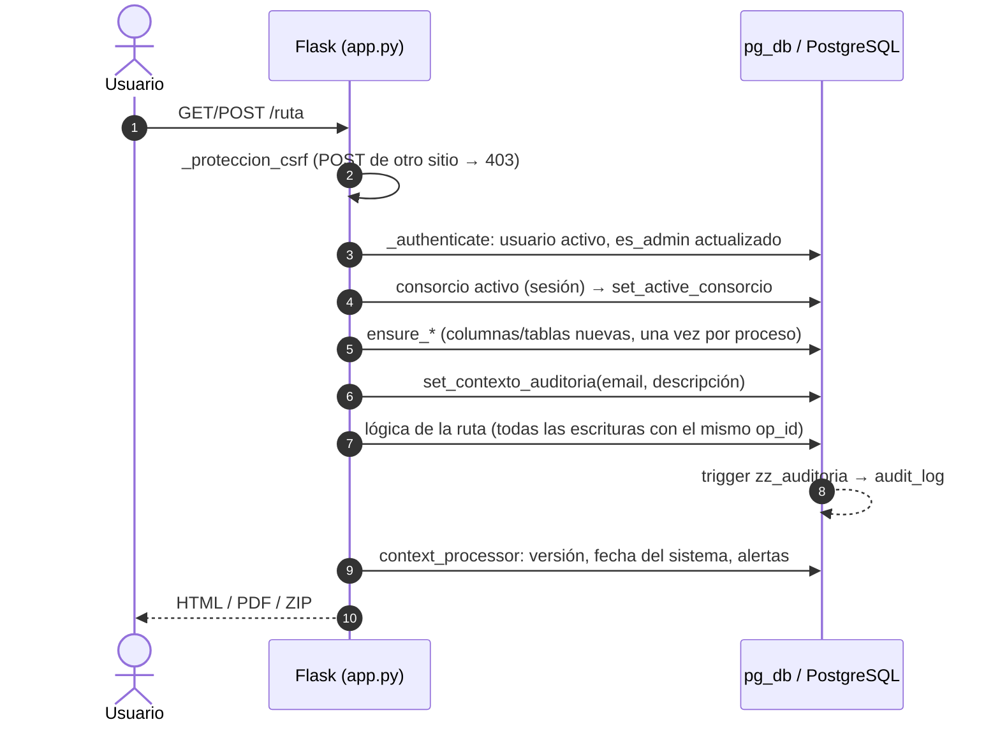
```mermaid
sequenceDiagram
    autonumber
    actor U as Usuario
    participant F as Flask (app.py)
    participant DB as pg_db / PostgreSQL
    U->>F: GET/POST /ruta
    F->>F: _proteccion_csrf (POST de otro sitio → 403)
    F->>DB: _authenticate: usuario activo, es_admin actualizado
    F->>DB: consorcio activo (sesión) → set_active_consorcio
    F->>DB: ensure_* (columnas/tablas nuevas, una vez por proceso)
    F->>DB: set_contexto_auditoria(email, descripción)
    F->>DB: lógica de la ruta (todas las escrituras con el mismo op_id)
    DB-->>DB: trigger zz_auditoria → audit_log
    F->>DB: context_processor: versión, fecha del sistema, alertas
    F-->>U: HTML / PDF / ZIP
```

### 9.2 Cerrar una liquidación con intereses

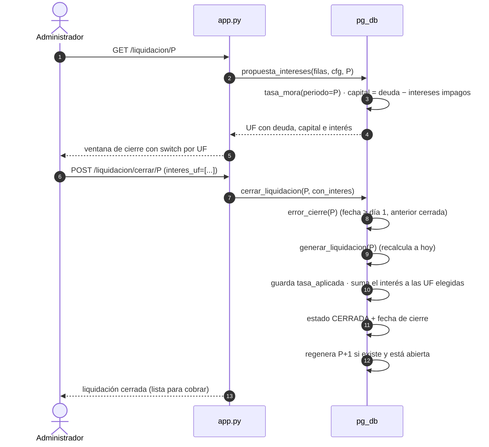
```mermaid
sequenceDiagram
    autonumber
    actor A as Administrador
    participant F as app.py
    participant D as pg_db
    A->>F: GET /liquidacion/P
    F->>D: propuesta_intereses(filas, cfg, P)
    D->>D: tasa_mora(periodo=P) · capital = deuda − intereses impagos
    D-->>F: UF con deuda, capital e interés
    F-->>A: ventana de cierre con switch por UF
    A->>F: POST /liquidacion/cerrar/P (interes_uf=[...])
    F->>D: cerrar_liquidacion(P, con_interes)
    D->>D: error_cierre(P) (fecha ≥ día 1, anterior cerrada)
    D->>D: generar_liquidacion(P) (recalcula a hoy)
    D->>D: guarda tasa_aplicada · suma el interés a las UF elegidas
    D->>D: estado CERRADA + fecha de cierre
    D->>D: regenera P+1 si existe y está abierta
    F-->>A: liquidación cerrada (lista para cobrar)
```

### 9.3 Registrar un pago de expensas

```mermaid
sequenceDiagram
    autonumber
    actor A as Usuario
    participant F as app.py (/cobranzas)
    participant D as pg_db
    A->>F: POST /cobranzas/P/pagar/UF (monto, fecha, bonificación)
    F->>F: _importe(monto) (rechaza nan, inf, negativos)
    F->>D: registrar_pago(P, UF, monto, fecha)
    D->>D: _error_cobro: P debe ser la última cerrada
    D->>D: fecha ≤ fecha del sistema y Caja del mes abierta
    D->>D: INSERT caja ENTRADA "Expensas P - ... - UF n"
    opt bonificación > 0
        D->>D: INSERT caja SALIDA BONIFICACION
    end
    D->>D: INSERT pagos (caja_id, bonif_caja_id)
    D->>D: regenerar P+1 abierta (deuda anterior e intereses impagos)
    F-->>A: estado TOTAL / PARCIAL + recibo con QR
```

### 9.4 Pagar una factura con el Fondo de Reserva

```mermaid
sequenceDiagram
    autonumber
    actor A as Usuario
    participant F as app.py (/facturas)
    participant D as pg_db
    A->>F: POST pagar (fecha, con_fondo=1, observación)
    F->>F: valida fecha, Caja no bloqueada, no pagada antes
    F->>D: pagar_factura(fid, fecha, con_fondo=True, observacion)
    D->>D: factura PAGADA, categoría FONDO_RESERVA
    D->>D: caja SALIDA "[Fondo de Reserva] Pago factura ..." (factura_id)
    alt tiene gasto vinculado
        D->>D: gasto → VARIABLE_FR, conserva naturaleza (si su liquidación está abierta)
    else sin gasto
        D->>D: INSERT gasto VARIABLE_FR (financiación FONDO_RESERVA)
    end
    Note over D: el gasto no se cobra en expensas<br/>y el libro del fondo resta la salida de Caja
    F-->>A: factura pagada
```

### 9.5 Exportación completa (v10.0)

```mermaid
sequenceDiagram
    autonumber
    actor A as Admin
    participant F as app.py (/exportar)
    participant D as pg_db
    A->>F: GET /exportar
    F->>F: _require_admin (si no es admin → redirige)
    F->>D: exportar_consorcio()
    D->>D: tablas con consorcio_id (sin usuarios ni permisos)
    D->>D: quita config.clave_firma
    D-->>F: {tabla: columnas, filas}
    F->>F: datos/*.csv + consorcio_completo.json + comprobantes/ + LEEME.txt
    F-->>A: exportacion_<consorcio>_<fecha>.zip
```
